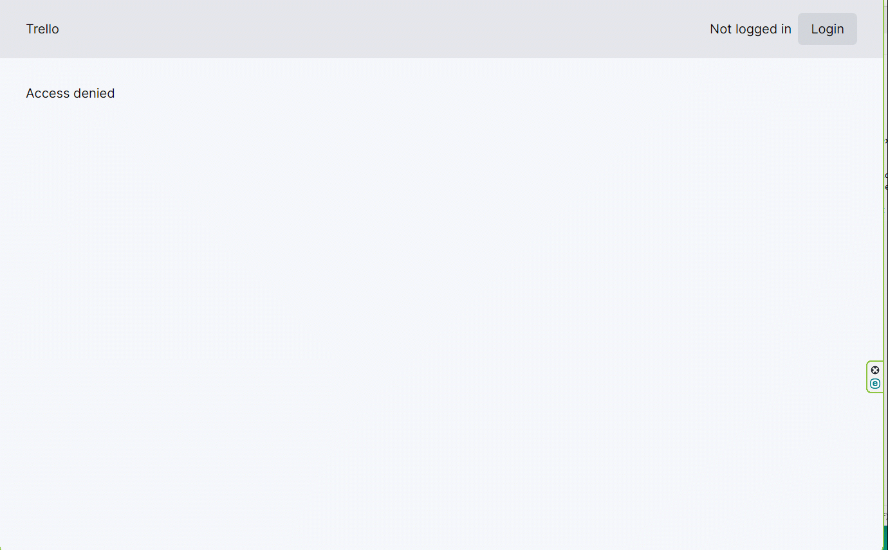

## Liveblocks - trello clone

### A minimalistic Trello clone based on using Liveblocks

- live collaboration with cursor chat
- comments, reactions, and drawing designs

##### [Liveblocks](https://liveblocks.io/) provides developers with a complete toolkit to embed performant collaboration features to your product remarkably fast.

[Site](https://liveblocks-trello-sxidsvit.vercel.app/)

#### Technologies

- Next.js
- TypeScript
- Liveblocks
- Mongo Atlas
- Tailwind CSS

#### .env

```js 
GOOGLE_CLIENT_ID=
GOOGLE_CLIENT_SECRET=

MONGODB_URI=

LIVEBLOCKS_SECRET_KEY=

AUTH_SECRET=

NEXTAUTH_URL=

```



---

##### Contact with me:

[][linkedin]

[linkedin]: https://www.linkedin.com/in/sergiy-antonyuk/

##### I can't express how much I have learned from [you](https://www.youtube.com/@CodingWithDawid) ! <br> Thanks for the hard and smart work.
